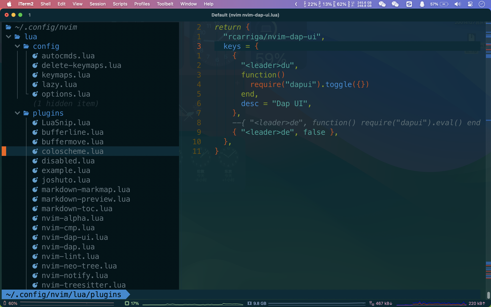
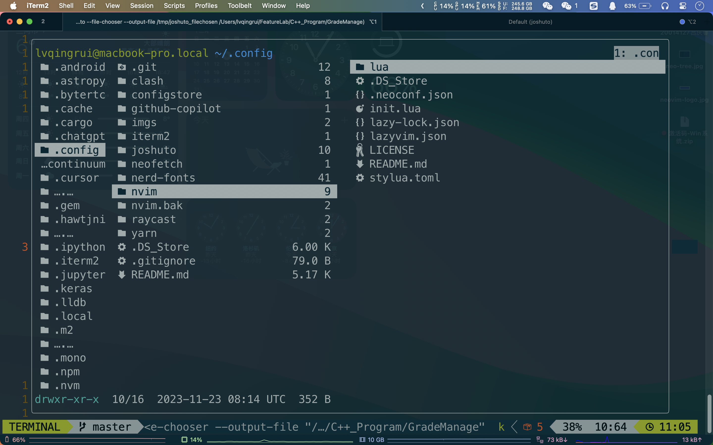

# Jeffery's Neovim Config

 

## 快捷键

### 1基础编译器特性

#### 1.1 Leader键和最常用的作用键

`<leader>`键 : `<space>`  

`<leader>qq` : 退出当前 Vim 窗口(与原版vim中的`:q`命令一样)  

`<leader>qa` : 退出所有的窗口(与原版vim中的`:quitall`命令一样)

`<C-s>`: 保存当前文件(与原版vim中的`:w`命令一样)

---

#### 1.2 最基本键位
| 快捷键 |                行为                |
|:------:|:----------------------------------:|
|   `i`  |        `将光标向上移动一行`        |
|   `k`  |        `将光标向下移动一行`        |
|   `j`  |        `将光标向左移动一行`        |
|   `l`  |        `将光标向右移动一行`        |
|   `J`  |  `将光标移动到当前行的第一个字符`  |
|   `L`  | `将光标移动到当前行的最后一个字符` |
|   `I`  |        `将光标向上移动五行`        |
|   `K`  |        `将光标向下移动五行`        |
|  `C-l` | `在插入模式下光标放置最后一个位置` |
|   `e`  |       `移动到这个单词的结尾`       |
|   `w`  |      `移动到下一个单词的开头`      |
|   `b`  |      `移动到上一个单词的开头`      |

---

#### 1.3 窗口管理

##### 1.3.1 通过切分屏幕创造窗口
| 快捷键 | 行为                         |
|:--------:|:------------------------------:|
| `si`   | `新建一个分屏并把它放在上方` |
| `sk`   | `新建一个分屏并把它放在下方` |
| `sj`   | `新建一个分屏并把它放在左边` |
| `sl`   | `新建一个分屏并把它放在右边` |

---

##### 1.3.2 移动光标到不同的分屏
|    快捷键   |           行为           |
|:-----------:|:------------------------:|
| `<leader>i` | `将光标移动至上面的分屏` |
| `<leader>k` | `将光标移动至下面的分屏` |
| `<leader>j` | `将光标移动至左边的分屏` |
| `<leader>l` | `将光标移动至右边的分屏` |

---

##### 1.3.3 为分屏设置窗口大小
|  快捷键 |         行为         |
|:-------:|:--------------------:|
| `<C-i>` | `增加当前窗口的高度` |
| `<C-k>` | `减少当前窗口的高度` |
| `<C-j>` | `减少当前窗口的宽度` |
| `<C-l>` | `增加当前窗口的宽度` |

---

##### 1.3.4 关闭窗口
|    快捷键    |          行为          |
|:------------:|:----------------------:|
| `<leader>qq` | `退出当前光标所在窗口` |
| `<leader>qa` |     `退出所有窗口`     |

---

#### 1.4 标签页管理

|        快捷键        |         行为         |
|:--------------------:|:--------------------:|
| `<leader><Tab><Tab>` |   `新建一个标签页`   |
|   `<leader><Tab>[`   | `移动至上一个标签页` |

---

### 插件按键

#### 1文件预览
##### [1.1 树状文件系统-Neo-tree.Nvim](https://github.com/nvim-neo-tree/neo-tree.nvim) 

|    快捷键    |                  行为                  |
|:------------:|:--------------------------------------:|
|      `l`     |               `打开文件`               |
|    `<cr>`    |               `打开文件`               |
|      `P`     |               `预览文件`               |
|  `<leader>l` |            `将光标聚焦预览`            |
|    `<esc>`   |                 `取消`                 |
|      `S`     |             `上下分屏打开`             |
|      `s`     |             `左右分屏打开`             |
|      `C`     |            `收起当前文件夹`            |
|      `z`     |           `收齐所有的文件夹`           |
|      `T`     |    `创建文件或者文件夹(如果以/结尾)`   |
|      `M`     |              `创建文件夹`              |
|      `d`     |                 `删除`                 |
|      `r`     |                `重命名`                |
|      `y`     |            `复制文件/文件夹`           |
|      `x`     |                 `剪切`                 |
|      `p`     |                 `粘贴`                 |
|      `c`     | `与y类似 类似直接拷贝一份(不同的名字)` |
|      `m`     |   `目录不一样则剪切，目录一样则改名`   |
|      `q`     |           `关闭Neo-tree窗口`           |
|      `R`     |                 `刷新`                 |
|      `?`     |              `快捷键帮助`              |
|      `h`     |           `显示文件详细信息`           |
|      `.`     |         `把文件夹设置为根目录`         |
|      `H`     |          `显示/隐藏 隐藏文件`          |
|      `/`     |                 `搜索`                 |
|      `D`     |            `仅仅搜索文件夹`            |
|      `f`     |                 `过滤`                 |
|    `<C-x>`   |               `清除过滤`               |
|      `o`     |       `打开帮助(排序的帮助指南)`       |
|     `oc`     |          `通过创建时间来排序`          |
|     `od`     |          `通过错误诊断来排序`          |
|     `og`     |           `通过git状态来排序`          |
|     `om`     |            `通过修改来排序`            |
|     `on`     |            `通过名字来排序`            |
|     `os`     |            `通过大小来排序`            |
|     `ot`     |            `通过类型来排序`            |
|     `]g`     |         `下一个git修改过的文件`        |
|     `[g`     |         `上一个git修改过的文件`        |
| `<leader>ng` |     `打开Neo-tree的git-status面板`     |
|     `ga`     |                `git add`               |
|     `gc`     |              `git commit`              |
|     `gp`     |               `git push`               |
|     `gg`     |          `git_commit_and_push`         |

 

---

#### [1.2 Joshuto](https://github.com/kamiyaa/joshuto)

|  快捷键 |            行为            |
|:-------:|:--------------------------:|
|   `Q`   |      `打开Joshuto界面`     |
|   `i`   |       `光标向上移动`       |
|   `k`   |       `光标向下移动`       |
|   `I`   |      `光标向上移动6个`     |
|   `K`   |      `光标向下移动6个`     |
|   `gg`  |      `光标移动到开头`      |
|   `G`   |      `光标移动到结尾`      |
|   `[`   |  `上一级目录往上移动一个`  |
|   `]`   |  `上一级目录向下移动一个`  |
|   `j`   |           `cd ..`          |
|   `l`   |           `打开`           |
|   `cd`  |            `:cd`           |
|   `dd`  |         `剪切文件`         |
|   `dD`  |         `删除文件`         |
|   `yy`  |         `复制文件`         |
|   `yn`  |   `复制文件名字(有后缀)`   |
|   `y.`  |  `复制文件名字(没有后缀)`  |
|   `yf`  |      `复制文件的路径`      |
|   `yd`  |   `复制文件的上一级路径`   |
|   `pp`  |         `粘贴文件`         |
|   `po`  |      `粘贴文件(覆盖)`      |
|   `a`   | `改名字(在文件名后面修改)` |
|   `A`   | `改名字(在文件名前面修改)` |
|   `T`   |      `创建文件(touch)`     |
|   `M`   |     `创建文件夹(mkdir)`    |
| `space` |           `选择`           |
|   `v`   |      `选择没有选择的`      |
|   `V`   |         `选择模式`         |
|   `cm`  |       `设置文件权限`       |
|   `bb`  |        `批量改名字`        |
|   `S`   |         `进入Shell`        |
|  `git`  |        `进入lazygit`       |
|   `cn`  |          `重命名`          |
|   `/`   |           `搜索`           |
|   `f`   |           `过滤`           |
|   `=`   |        `查找下一个`        |
|   `-`   |        `查找上一个`        |
|   `gd`  |      `cd ~/Downloads`      |
|   `gD`  |       `cd ~/Desktop`       |
|   `gh`  |           `cd ~/`          |
|  `gcf`  |       `cd ~/.config`       |
|  `gcn`  |     `cd ~/.config/nvim`    |
|  `gcj`  |   `cd ~/.config/joshuto`   |
|   `?`   |         `提供帮助`         |

 

---

